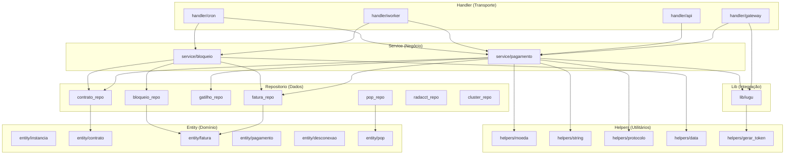
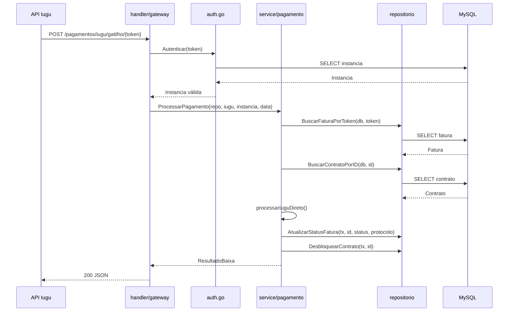
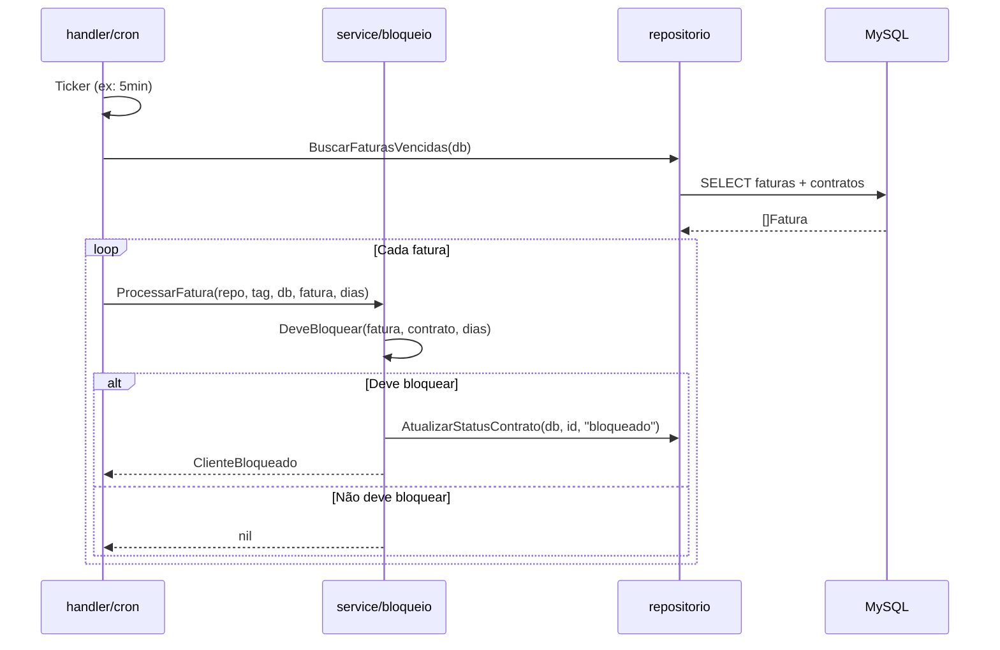
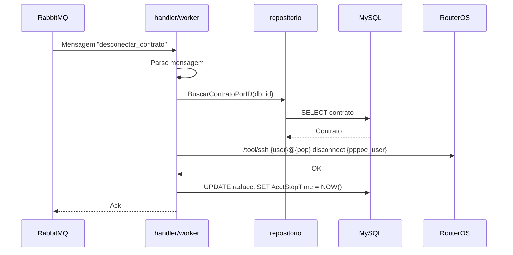

# SDD-000 — Documentação de Arquitetura

**Status:** Pendente
**Autor:** Knowledge Engineer
**Prioridade:** Média
**Dependencias:** SDD-018, SDD-019, SDD-020, SDD-021, SDD-022, SDD-023, SDD-024, SDD-025, SDD-026

## 1. Objetivo

Criar a documentação de arquitetura completa do sistema após a refatoração, descrevendo a estrutura em camadas, os fluxos de dados e a organização dos pacotes. Esta documentação serve como referência para novos desenvolvedores e para agentes de IA.

## 2. Escopo

### 2.1 docs/arquitetura.md

Diagrama Mermaid da arquitetura em camadas + descrição de cada camada:



### 2.2 docs/estrutura.md

Árvore de diretórios completa após refatoração:

```
gestor/
├── cmd/
│   ├── gestor/main.go          <- Entrypoint principal (cron + worker)
│   ├── gateway/main.go         <- Gateway Iugu (porta 8082)
│   ├── api/main.go             <- API REST (porta 8083)
│   └── worker/main.go          <- Worker独立 (processamento filas)
├── internal/
│   ├── entity/                 <- Tipos de domínio enriquecidos
│   │   ├── instancia.go
│   │   ├── contrato.go
│   │   ├── fatura.go
│   │   ├── pagamento.go
│   │   ├── desconexao.go
│   │   └── pop.go
│   ├── helpers/                <- Funções puras e utilitárias
│   │   ├── moeda.go
│   │   ├── string.go
│   │   ├── protocolo.go
│   │   ├── data.go
│   │   └── gerar_token.go
│   ├── lib/                    <- Bibliotecas de integração externa
│   │   └── iugu/cliente.go
│   ├── repositorio/            <- Acesso a dados (Repository pattern)
│   │   ├── fatura_repo.go
│   │   ├── contrato_repo.go
│   │   ├── gatilho_repo.go
│   │   ├── bloqueio_repo.go
│   │   ├── pop_repo.go
│   │   ├── radacct_repo.go
│   │   └── cluster_repo.go
│   ├── service/                <- Regras de negócio
│   │   ├── pagamento/
│   │   │   ├── processar.go
│   │   │   ├── baixa.go
│   │   │   ├── contrato.go
│   │   │   └── origem.go
│   │   └── bloqueio/
│   │       └── cliente.go
│   ├── handler/                <- Transporte HTTP / handlers
│   │   ├── gateway/
│   │   ├── api/
│   │   ├── worker/
│   │   └── cron/
│   ├── config/config.go        <- Configurações (env vars)
│   └── infra/                  <- Infraestrutura (banco, fila, log)
│       ├── banco/
│       ├── mensageria/
│       └── logger/
├── docs/                       <- Documentação
│   ├── arquitetura.md
│   ├── estrutura.md
│   └── diagrama.md
├── .opencode/                  <- Config + memória do projeto
│   ├── specs/                  <- SDDs
│   ├── memory/                 <- Banco de Memória do Projeto
│   └── plans/                  <- Planos de execução
└── Dockerfile
```

### 2.3 docs/diagrama.md

Diagramas Mermaid dos principais fluxos:

**Fluxo de Webhook Iugu:**



**Fluxo de Cron (Bloqueio):**



**Fluxo de Worker (Desconexão):**



## 3. Camadas da Arquitetura

### 3.1 Entity (internal/entity)

Tipos de domínio enriquecidos com métodos de negócio. Não contêm dependências externas. São os blocos fundamentais do sistema.

### 3.2 Helpers (internal/helpers)

Funções puras e utilitárias sem estado (exceto `GerarProtocolo` que usa contador global). Não dependem de nenhum outro pacote interno.

### 3.3 Lib (internal/lib)

Clientes para APIs externas (Iugu). Encapsulam chamadas HTTP, serialização e lógica de integração.

### 3.4 Repositório (internal/repositorio)

Acesso a dados seguindo o padrão Repository. Cada arquivo agrupa queries relacionadas a uma entidade. Funções recebem `*sql.DB` ou `*sql.Tx` explicitamente.

### 3.5 Service (internal/service)

Regras de negócio puras. Services dependem de interfaces (não de implementações concretas de repositório). Não têm acesso direto a `*sql.DB`.

### 3.6 Handler (internal/handler)

Camada de transporte. Handlers fazem parse de requests, delegam para services e formatam respostas. Não contêm lógica de negócio ou SQL.

## 4. Arquivos a criar

| Arquivo | Ação |
|---------|------|
| `docs/arquitetura.md` | Criar — diagrama + descrição das camadas |
| `docs/estrutura.md` | Criar — árvore + explicação dos pacotes |
| `docs/diagrama.md` | Criar — fluxos (webhook, cron, worker) |

## 5. Critérios de Aceite

- [ ] `docs/arquitetura.md` contém diagrama Mermaid funcional
- [ ] `docs/estrutura.md` reflete a estrutura real pós-refatoração
- [ ] `docs/diagrama.md` documenta os 3 fluxos principais
- [ ] Toda documentação em português
- [ ] Documentos aprovados pelo time técnico
