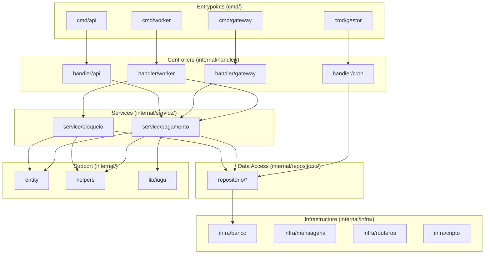

# Arquitetura do Sistema — Gestor ISP (Refatorado)

## 1. Introdução

O Gestor ISP é um backend monolítico em Go que gerencia pagamentos (Iugu), bloqueio de clientes
inadimplentes, sincronização de conexões PPPoE (RouterOS) e dashboards em tempo real (SSE).
O sistema processa webhooks HTTP, filas RabbitMQ, tarefas cron e expõe uma API REST.

Esta documentação descreve a arquitetura pós-refatoração, organizada em camadas com
separação clara de responsabilidades seguindo o padrão WMVC (Web MVC).

---

## 2. Diagrama da Arquitetura



---

## 3. Descrição das Camadas

### `entity/` — Model (Dados)

Entidades de domínio enriquecidas com métodos de negócio. Sem dependências externas.
São os blocos fundamentais do sistema: `Instancia`, `Contrato`, `Fatura`,
`MensagemPagamentoIugu`, `MensagemDesconexaoContrato`, `POP`.

### `helpers/` — Helper (Funções Puras)

Funções utilitárias sem estado ou dependências internas: formatação de moeda,
geração de protocolo, manipulação de data/string, tokens criptográficos.

### `lib/` — Library (Serviço Externo)

Clientes para APIs externas. Atualmente `lib/iugu/cliente.go` encapsula chamadas HTTP
para a API de fatura da Iugu. Separado de `service/` para permitir troca de provedor.

### `repositorio/` — Model (Queries SQL)

Acesso a dados no padrão Repository. Cada arquivo agrupa queries de uma entidade
(`fatura_repo.go`, `contrato_repo.go`, etc.). Funções recebem `*sql.DB` ou `*sql.Tx`
explicitamente — não há estado interno.

### `service/` — Regra de Negócio

Lógica de negócio pura. Services dependem de interfaces de repositório (não de implementações
concretas). Não têm acesso direto a `*sql.DB`. Subdividido em:
- `service/pagamento/`: processamento de webhooks Iugu, baixa financeira, desbloqueio
- `service/bloqueio/`: detecção de inadimplência e aplicação de bloqueio

### `handler/` — Controller (Orquestração)

Camada de transporte/orquestração. Faz parse de requests, delega para services,
formata respostas. **Não contém lógica de negócio nem SQL:**
- `handler/gateway/`: HTTP gateway da Iugu (porta 8082)
- `handler/api/`: REST API (porta 8083)
- `handler/worker/`: consumidores RabbitMQ
- `handler/cron/`: agendador de tarefas

### `infra/` — Infraestrutura Base

Conexões e serviços de sistema: pool MySQL, publisher RabbitMQ, cliente RouterOS,
criptografia (CI3 + HKDF), logger ANSI, fuso horário. Apenas `handler/` e
`repositorio/` dependem diretamente de `infra/`.

---

## 4. Fluxos de Dados

### Webhook Iugu

```
Iugu → POST HTTP → handler/gateway → autentica token → RabbitMQ
→ handler/worker → service/pagamento → consulta Iugu API
→ repositorio → MySQL → publica desconexão se necessário
```

### Desconexão PPPoE (RouterOS)

```
HTTP/RabbitMQ → handler/api ou handler/worker → repositorio (busca contrato)
→ infra/routeros → Mikrotik (disconnect PPPoE) → radacct UPDATE
```

### Cron (Bloqueio de Inadimplentes)

```
handler/cron → ticker → repositorio (faturas vencidas)
→ service/bloqueio → DeveBloquear → repositorio (UPDATE contrato)
→ RabbitMQ (desconectar_contrato)
```

### Dashboard SSE

```
handler/logger → hook → SSE hub → navegador
```

---

## 5. Regras de Dependência entre Camadas

```
handler → service (via interfaces)
handler → repositorio (para queries simples/leitura)
service → entity, helpers, lib
repositorio → entity (tipos de retorno), infra/banco (*sql.DB)
handler → infra (mensageria, logger, banco)

PROIBIDO:
  repositorio → service
  handler → infra/banco direto
  service → infra/banco
```

### Mapa de Importações por Camada

| Camada | Pode Importar | Não Pode Importar |
|--------|---------------|-------------------|
| `handler/` | `service/`, `repositorio/`, `infra/`, `entity/` | `lib/` (exceto indireto via service) |
| `service/` | `repositorio/` (interface), `entity/`, `helpers/`, `lib/` | `infra/`, `handler/` |
| `repositorio/` | `entity/`, `infra/banco` | `service/`, `handler/`, `lib/` |
| `entity/` | nada (standard library only) | qualquer pacote interno |
| `helpers/` | nada (standard library only) | qualquer pacote interno |
| `lib/` | `entity/` | `service/`, `repositorio/` |

---

## 6. Tecnologias

| Tecnologia | Versão | Uso |
|------------|--------|-----|
| Go | 1.22+ | Linguagem principal |
| robfig/cron | v3 | Agendador de tarefas |
| streadway/amqp | v1.1 | Cliente RabbitMQ |
| go-sql-driver/mysql | v1.9 | Driver MySQL |
| routeros | — | API RouterOS Mikrotik |
| RabbitMQ | 3.x | Mensageria |
| Iugu API | v1 | Gateway de pagamentos |
| Docker | qualquer | Empacotamento |
