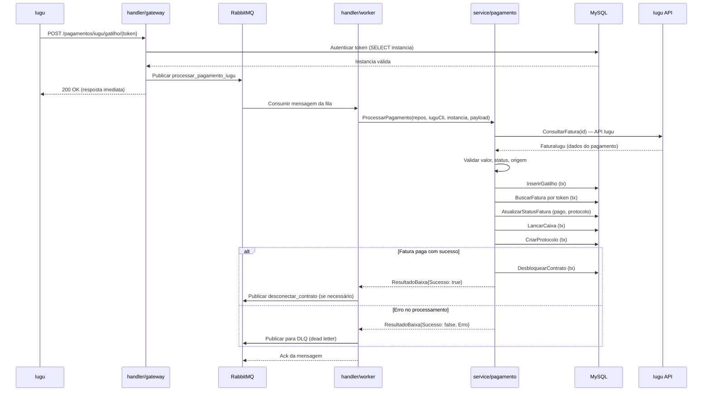
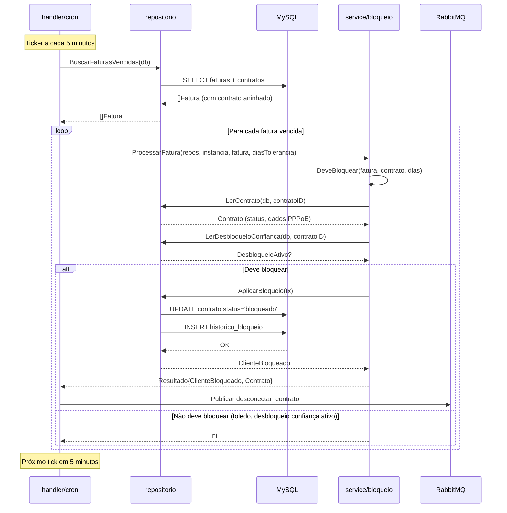
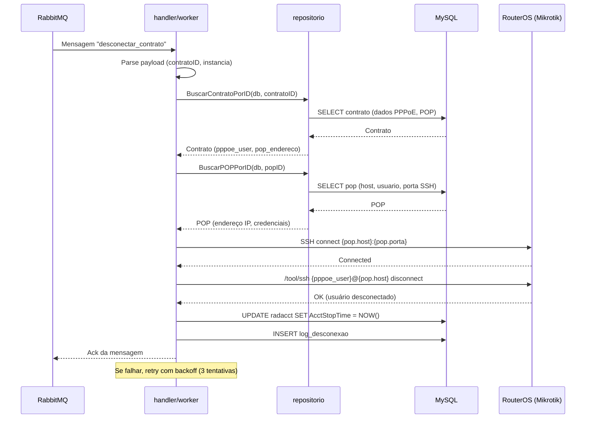
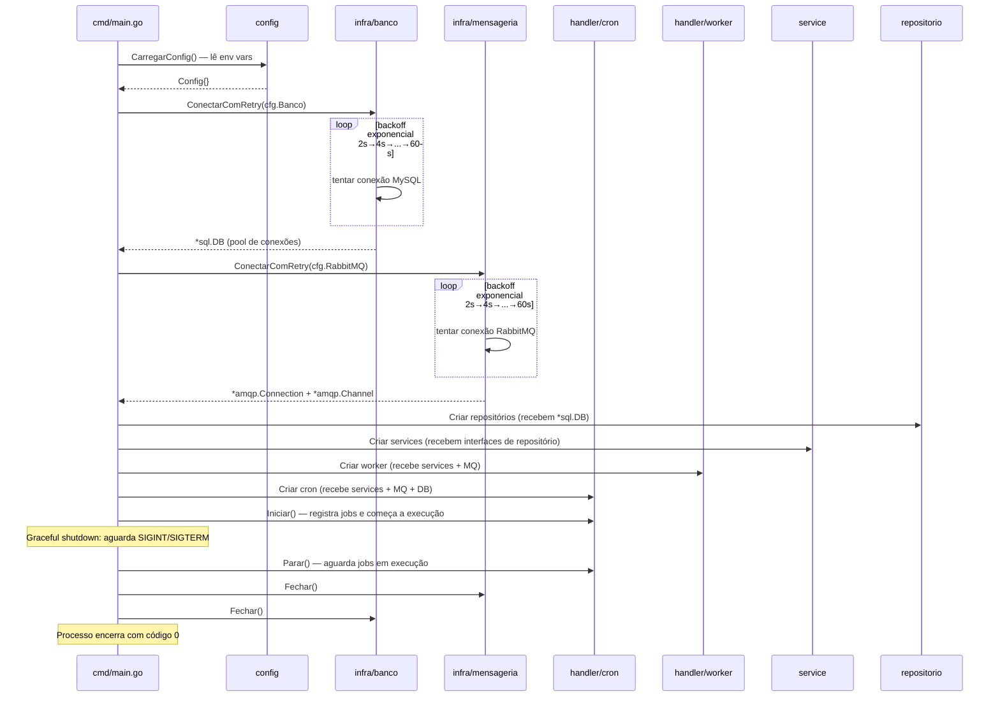

# Diagramas de Sequência

## 1. Webhook Iugu (Processar Pagamento)

Fluxo completo: Iugu envia webhook HTTP → gateway autentica → publica na fila →
worker consome → service processa → repositorio persiste.

**Observações:**
- O gateway responde `200` imediatamente para a Iugu, antes do processamento
- O processamento real é assíncrono via RabbitMQ
- A transação de banco garinte atomicidade entre baixa, atualização e desbloqueio

---

## 2. Cron — Listar Clientes Vencidos (Bloqueio)

O cron scheduler executa periodicamente (a cada 5 min) para detectar faturas vencidas
e aplicar bloqueio nos contratos inadimplentes.

**Regras de bloqueio:**
- Dias de tolerância configurados por instância
- Contratos com desbloqueio de confiança ativo são ignorados
- Bloqueio só ocorre se fatura vencida há mais de N dias

---

## 3. Fluxo de Desconexão RouterOS (via Worker)

Quando um contrato precisa ser desconectado (pagamento pendente ou bloqueio),
uma mensagem é publicada no RabbitMQ e o worker executa a desconexão via SSH.

**Resiliência:**
- 3 tentativas de reconexão SSH (1s, 2s, 4s de intervalo)
- Se todas falharem, a mensagem vai para DLQ para inspeção manual
- Log detalhado de cada tentativa (logger.Aviso)

---

## 4. Fluxo de Boot (Inicialização dos Componentes)

Como os entrypoints inicializam o sistema e conectam as dependências.

**Entrypoints específicos:**

| Binary | Inicializa | Porta | Dependências |
|--------|------------|-------|-------------|
| `cmd/gestor` | cron scheduler | — | DB + MQ + repos + services |
| `cmd/worker` | consumer RabbitMQ | — | DB + MQ + repos + services |
| `cmd/gateway` | HTTP server Iugu | 8082 | DB + MQ + services |
| `cmd/api` | HTTP REST API | 8083 | DB + MQ + services + infra/routeros |
